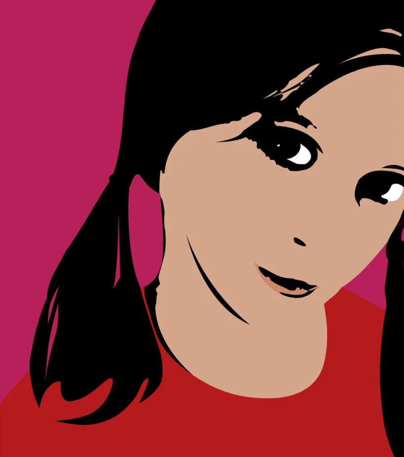
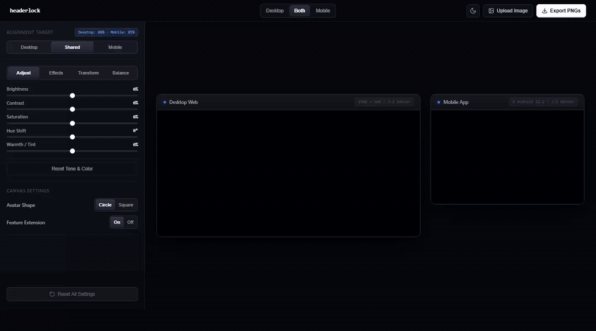
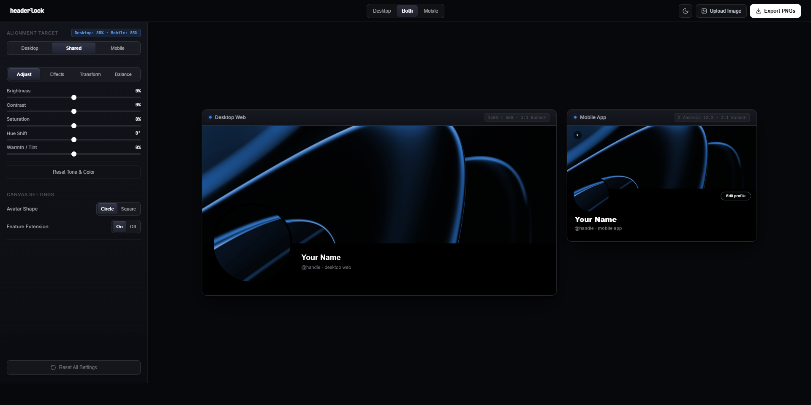
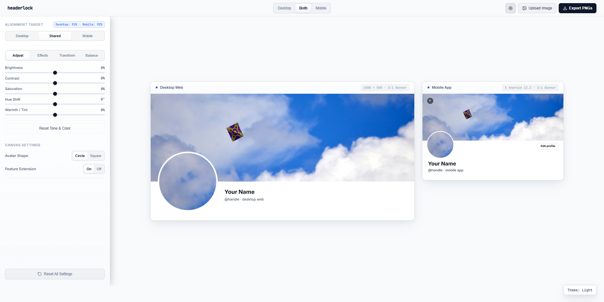
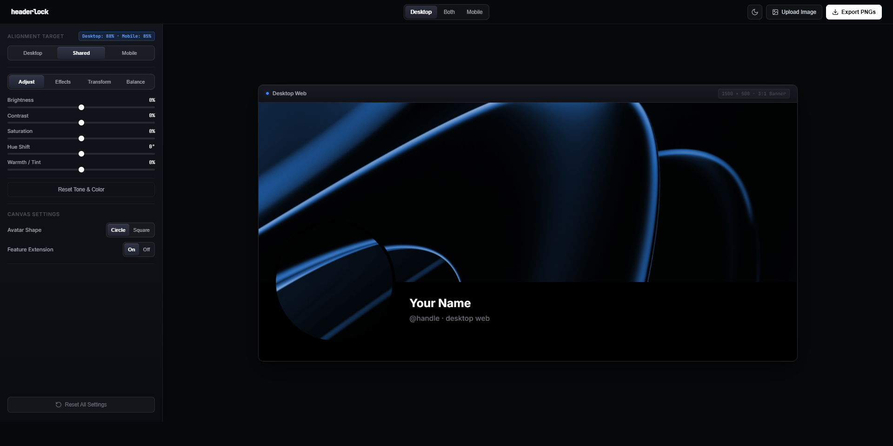
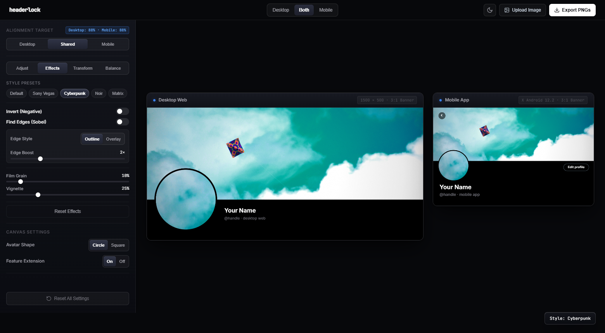

<p align="center">
  <a href="https://miyakejima.github.io/headerlock/">
    
  </a>
</p>

<h1 align="center">headerlock</h1>

<p align="center">
  <strong>Seamless X (Twitter) Profile Alignment Studio</strong><br>
  Pixel-perfect boundary lock across Desktop Web and Mobile App.
</p>

<p align="center">
  <a href="https://miyakejima.github.io/headerlock/"><strong>🚀 Launch Web App</strong></a> ·
  <a href="#interactive-demo">Interactive Demo</a> ·
  <a href="#why-this-exists">Why This Exists</a> ·
  <a href="#studio-tour">Studio Tour</a> ·
  <a href="#alignment-targets">Alignment Targets</a> ·
  <a href="#verified-geometry">Verified Geometry</a>
</p>

<p align="center">
  <em>Free, full-featured client-side creative studio. Open and use directly in your browser:</em><br>
  👉 <a href="https://miyakejima.github.io/headerlock/"><strong>https://miyakejima.github.io/headerlock/</strong></a>
</p>

---

## Interactive Demo

<p align="center">
  <a href="https://miyakejima.github.io/headerlock/">
    
  </a>
</p>

*Live walkthrough: real-time tone adjustments, Cyberpunk and Sony Vegas shaders, 3×3 Sobel convolution edge detection, 90° lossless rotation, direct canvas panning, and instant switching between side-by-side workstation and 1160px desktop focus views.*

---

## Why this exists

On X (Twitter), the banner and avatar are placed differently on web and mobile:
- **Desktop Web**: The banner is displayed at approximately $2.99:1$ to $3:1$, and the circular avatar sits with its vertical center aligned directly on the bottom banner boundary ($Y=500$).
- **Mobile App (Android 12.2 Compose)**: The banner is $3:1$, but the circular avatar sits shifted left ($52/411\text{ dp}$ from screen left) and overlaps the banner by only $28\text{ dp}$ (leaving the avatar center at $331.35\text{ px}$ on a $914\text{ px}$ layout).

Because the two platforms place the avatar in different locations relative to the banner, an avatar that looks aligned on desktop will be broken on mobile, and vice versa.

**headerlock** solves this by calculating the exact projective affine geometry and feature continuation between both layouts in real time, giving you a synchronized banner (`1500 × 500`) and avatar (`400 × 400`) ready for upload.

---

## Studio Tour

### 1. Dual-View Workstation (Zero Page Scrolling)
*Professional two-column workstation: permanent left-hand creative tool deck with zero canvas overlap, paired with an elongated Desktop Web card ($840\text{px}$) and compact Mobile App card ($450\text{px}$) side-by-side with zero vertical page scrolling at 100% zoom.*



### 2. High-Contrast Linen Light Theme
*Crisp light workstation layout with dedicated Tone & Color adjustments, live dual-seam score badge (`Desktop: 91% · Mobile: 92%`), and authentic X profile geometry.*



### 3. Focused View Modes (Desktop & Mobile)
*Need to inspect fine details? Click `Desktop` or `Mobile` in the header switcher (`[Desktop] [Both] [Mobile]`) to instantly isolate and expand either card to a massive high-resolution focus view ($1160\text{px}$ for Desktop, $620\text{px}$ for Mobile).*



### 4. Creative FX, Shaders & Style Presets
*Real-time 3×3 Sobel convolution kernel (find edges), Sony Vegas negative color invert, analog film grain, vignette, and instant Cyberpunk/Noir presets—with 100% boundary lock integrity preserved.*



---

## Key Features

- **Studio Workstation Architecture**:
  - **Zero Page Scrolling**: At 100% zoom, the entire application fits cleanly into the viewport with zero vertical or horizontal window scrolling.
  - **Permanent Left Creative Deck**: Dedicated control sidebar for adjustments, creative shaders, transform tools, and dual-seam balancing. Never covers the artwork while you tune sliders or toggles.
  - **Differentiated Canvas Lengths**: In `Both` mode, Desktop Web is rendered with long horizontal span ($840\text{px}$) while Mobile App sits alongside as a compact phone frame ($450\text{px}$).
  - **Center-Balanced Focus Modes**: Clean `[Desktop]` `[Both]` `[Mobile]` switcher in the header. Activating `Desktop` or `Mobile` isolates that view and expands it into an expansive focal display ($1160\text{px}$ / $620\text{px}$) with smooth transitions.
- **Tone & Color Adjustments**: Precision sliders for Brightness, Contrast, Saturation, Hue Shift, and Warmth/Tint with live readouts, double-click reset, and zero text selection artifacts.
- **Creative FX & Shaders**: Sony Vegas Negative Invert, 3×3 Sobel convolution kernel (Find Edges / Contour Overlay with adjustable boost), Analog Film Grain, and Vignette.
- **1-Click Style Presets**: Cyberpunk, Noir, Matrix, Sony Vegas, and Default.
- **Dual-Seam Optimizer & Crop Balance**: Multi-angle bilinear seam optimizer maximizing simultaneous desktop and mobile seam integrity ($\min(S_D, S_M)$), with live score readouts and manual override.
- **Direct Canvas Manipulation**: Click and drag directly on either the Desktop or Mobile canvas to pan your image in real time. Scroll the mouse wheel to zoom.
- **Three Precision Alignment Targets**:
  - **Shared (Recommended)**: Mathematical dual-seam optimizer finding the sweet-spot mapping that locks both desktop and mobile borders simultaneously.
  - **Desktop**: $100\%$ bit-exact alignment for Desktop web ($Y=500$).
  - **Mobile**: $100\%$ bit-exact alignment for X Android Compose app ($331.35\text{ px}$ center).
- **Feature Continuation**: Extends artistic patterns, lines, and gradients downward past the banner boundary so the bottom half of the avatar is never cut off or black.
- **AMOLED Dark & Linen Light Themes**: High-contrast, anti-glare studio background gradients with cohesive micro-dot paper texture and an animated theme switch.
- **One-Click Export**: Downloads `banner-1500x500.png` and `avatar-400x400.png` simultaneously.
- **100% Client-Side Privacy**: Runs completely inside your web browser. Your images never leave your machine.

---

## Alignment Targets

| Target | Description | Ideal For |
|---|---|---|
| **Shared** | Auto-balances seam alignment across both platforms simultaneously | General accounts viewed equally on web and mobile |
| **Mobile** | Exact mathematical lock for X Mobile App (Android 12.2 Compose) | Mobile-first creators and audiences |
| **Desktop** | Exact mathematical lock for X Desktop Web ($Y=500$ seam) | Desktop-first creators, portfolios, and web communities |

---

## Verified Android Geometry

Derived from reverse-engineering the official X Android 12.2 release APK (`com.x.profile.header` / `UserProfileHeaderUi.kt`):

| Property | Value | Mobile Preview ($914\text{ px}$) |
|---|---|---|
| Banner aspect ratio | $3.0$ | $914 \times 304.67\text{ px}$ |
| Logical screen width | $411\text{ dp}$ | $914\text{ px}$ |
| Profile horizontal padding | $12\text{ dp}$ | $26.69\text{ px}$ |
| Avatar image size | $80\text{ dp}$ | $177.91\text{ px}$ ($R = 88.95\text{ px}$) |
| Visible avatar overlap | $28\text{ dp}$ | $62.27\text{ px}$ |
| Avatar center $Y$ | $bannerH + 12\text{ dp}$ | $331.35\text{ px}$ |
| Avatar border | $2\text{ dp}$ overlay | $4.45\text{ px}$ inner overlay |

See [`ANDROID_REVERSE_ENGINEERING.md`](ANDROID_REVERSE_ENGINEERING.md) for the full geometric derivation.

---

## Launch Web App

### Open in Browser (Zero Install)
Launch immediately in your browser:  
👉 **[https://miyakejima.github.io/headerlock/](https://miyakejima.github.io/headerlock/)**

### Run Locally (Optional)
No build step or `npm install` needed. Double-click `launch.bat` or run:

```bash
# Using Node.js
node server.js

# Or using Python
python -m http.server 8080
```

Open `http://localhost:8080` in your browser.

---

## Automated Verification

Run the built-in test suite to verify geometry calculations, shared mode optimizer, and seam precision:

```bash
node --test
```

All 6 integration test suites verify layout geometry consistency to within $10^{-12}\text{ px}$.

---

## License

ISC © miyakejima
