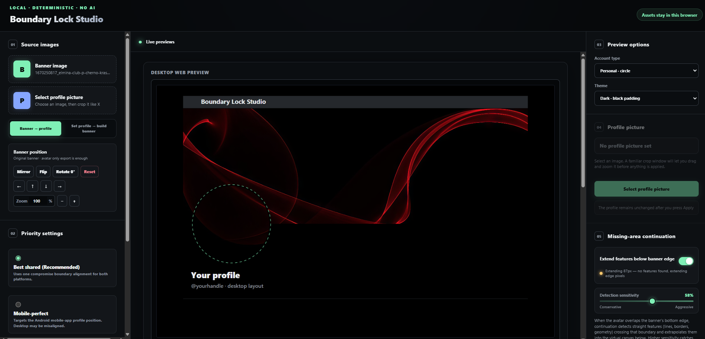
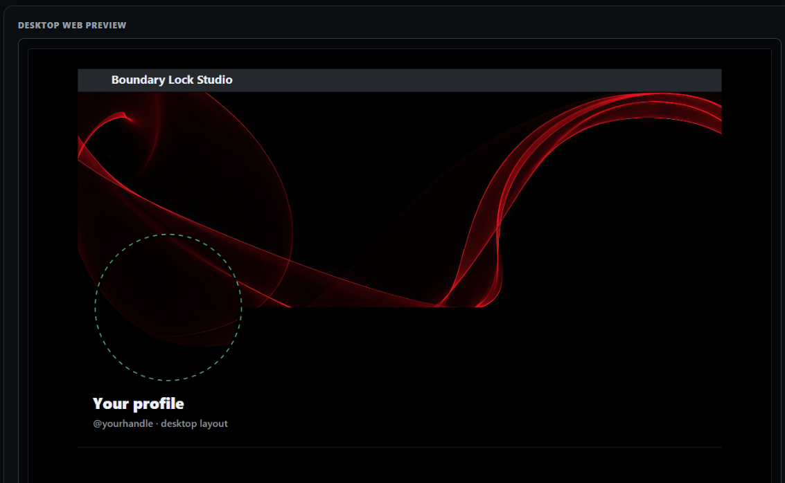
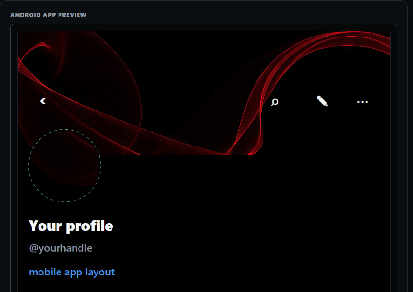

# headerlock

**Local · Deterministic · AMOLED Minimalist**

A precision studio for building seamless X (Twitter) profile pictures and banners that align perfectly across desktop and mobile. Runs entirely in your browser with zero server uploads, zero tracking, and pure client-side canvas rendering.

---

## Screenshots

**Full studio UI — source panel, live preview, priority and continuation controls**


**Desktop web preview — 1500 × 500 banner with 400 × 400 profile overlay**


**Android app preview — pixel-accurate avatar position verified against X Android 12.2**


---

## Why this exists

X's desktop and Android apps place the avatar circle at slightly different positions on the banner. A banner that looks aligned on desktop can show a mismatched crop on Android — and vice versa. headerlock renders both previews simultaneously using geometry verified against the X Android APK (Jetpack Compose layout constants, dp-to-pixel conversion, and JPEG upload flattening behavior) so you can see the exact result before you upload anything.

---

## Quick start

**No npm install. No build step.** Just double-click `launch.bat`.

```
launch.bat
```

The launcher auto-detects Python or Node.js, picks a free port, and opens the studio in your browser. Keep the terminal window open while using the tool.

**Requirements:** Python 3 _or_ Node.js — either one is enough.

---

## Workflows

### Set profile → build banner *(recommended)*

Mirrors the native X profile-picture flow:

1. Click **Select profile picture** and choose an image.
2. Reposition and zoom the image inside the X-style square crop window.
3. Click **Apply** — the profile is locked.
4. The 1500 × 500 banner is rebuilt automatically from the locked crop.
5. Export both files.

The locked profile defines a single global source transform. It is applied uniformly across every banner pixel — no independent banner crop, circular correction, blending, or local warp. If the transform does not cover the full banner area, the studio reports the gap and fills it with the selected background.

### Banner → profile *(original mode)*

For projects that start from a banner:

1. Choose **Banner → profile**.
2. Upload a banner and adjust with the banner tools.
3. Select Desktop, Android, or Shared layout.
4. Export the generated profile and adjusted banner.

---

## Layout modes

| Mode | Description |
|---|---|
| **Best shared** *(recommended)* | One compromise alignment that works acceptably on both desktop and Android |
| **Mobile-perfect** | Targets Android layout exactly; desktop may be slightly off |
| **Desktop-exact** | Targets desktop layout exactly; Android may be slightly off |

Desktop and Android priority controls are available in Banner → profile mode. They are hidden in Set profile mode so the editor behaves like the native X flow.

---

## Output

| File | Size | Format |
|---|---|---|
| Profile picture | 400 × 400 | PNG |
| Banner | 1500 × 500 | PNG |

Exported files use the uploaded source filename followed by `-profile.png` and `-banner.png`.

---

## Missing-area continuation

When the source image does not cover the full banner width, the studio can extrapolate the banner edge by detecting straight features (lines, borders, geometry) that cross the boundary and extending them into the uncovered area. Detection sensitivity is adjustable.

---

## Android geometry

The Android preview uses layout constants extracted from the X Android Jetpack Compose profile header (`com.x.profile.header` / `UserProfileHeaderUi.kt`), verified against:

- `12.1.1-release.0` (`versionCode 312011000`)
- `12.2.0-release.0` (`versionCode 312020000`)

Active constants (X 12.2 Compose path):

| Property | Value |
|---|---|
| Banner aspect ratio | 3.0 |
| Avatar image size | 80 dp |
| Profile horizontal padding | 12 dp |
| Under-banner layout reserve | 60 dp |
| Visible avatar overlap | 28 dp |

See [`ANDROID_REVERSE_ENGINEERING.md`](ANDROID_REVERSE_ENGINEERING.md) for the full geometric derivation, pixel-level verification results, and versioning notes.

---

## Automated tests

With Node.js installed:

```bash
node core.test.mjs
```

The test suite covers: profile locking, safe cancellation, Apply-only profile replacement, automatic banner rebuilding, full-circle source ownership, and the original banner-derived rendering path.

Additional integration tests:

```bash
node shared-mode-test.mjs
node desktop-priority-shared-test.mjs
node joint-adjustment-test.mjs
node test-pair-aware.mjs
node warp-test.mjs
```

---

## Project layout

```
boundary-lock-studio/
├── index.html                         # Studio web interface
├── app.js                             # UI application logic
├── core.js                            # Geometry engine and canvas rendering
├── styles.css                         # UI styles
├── server.js                          # Minimal Node.js static server
├── launch.bat                         # Windows one-click launcher (Python or Node.js)
├── core.test.mjs                      # Main unit test suite
├── shared-mode-test.mjs               # Best Shared mode integration tests
├── desktop-priority-shared-test.mjs   # Desktop priority integration tests
├── joint-adjustment-test.mjs          # Multi-pass adjustment tests
├── test-pair-aware.mjs                # Pair-aware banner integration tests
├── warp-test.mjs                      # Coordinate warp tests
├── weight-sweep.mjs                   # Parameter sweep diagnostic
├── overlap-analysis.mjs               # Boundary overlap diagnostic
├── ANDROID_REVERSE_ENGINEERING.md     # Android geometry derivation and verification
├── VERIFICATION.md                    # Implementation evidence and QA log
└── docs/screenshots/                  # UI screenshots
```

---

## License

ISC
