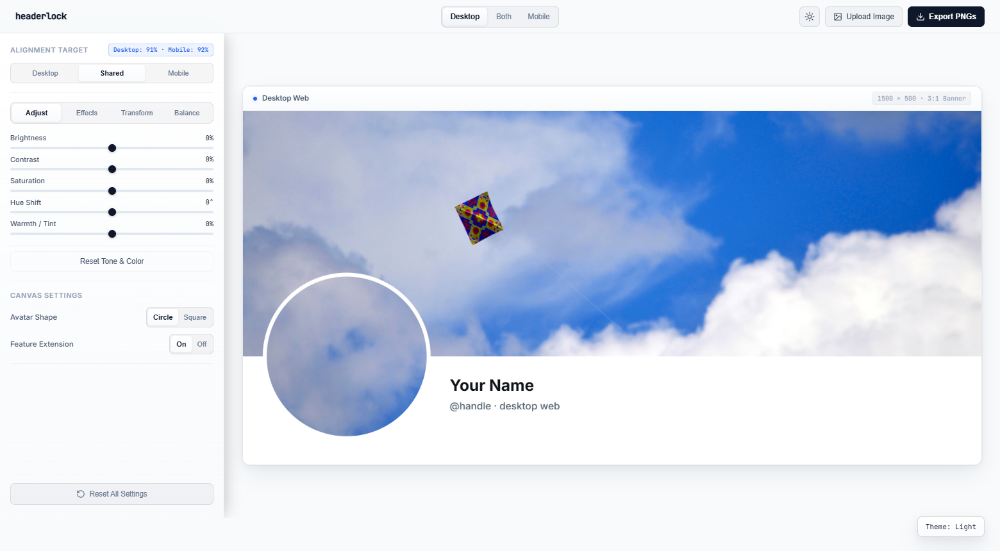
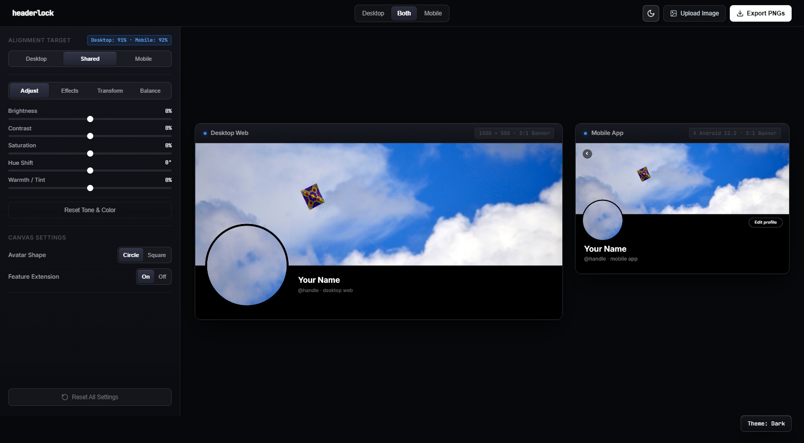

<p align="center">
  <a href="https://miyakejima.github.io/headerlock/">
    
  </a>
</p>

<h1 align="center">headerlock</h1>

<p align="center">
  <strong>Seamless X (Twitter) Profile Alignment Studio</strong><br>
  Pixel-perfect boundary lock across Desktop Web and Mobile App.
</p>

<p align="center">
  <a href="https://miyakejima.github.io/headerlock/"><strong>Launch Web App</strong></a> ·
  <a href="#why-this-exists">Why This Exists</a> ·
  <a href="#previews">Previews</a> ·
  <a href="#features">Features</a> ·
  <a href="#alignment-targets">Alignment Targets</a> ·
  <a href="#verified-geometry">Verified Geometry</a>
</p>

<p align="center">
  Open and use directly in your browser:<br>
  <a href="https://miyakejima.github.io/headerlock/"><strong>https://miyakejima.github.io/headerlock/</strong></a>
</p>

---

<p align="center">
  <a href="https://miyakejima.github.io/headerlock/">
    
  </a>
</p>

---

## Why this exists

On X (Twitter), the banner and profile avatar are placed differently on web and mobile:

- **Desktop Web**: The banner is displayed at approximately 3:1 aspect ratio, and the circular avatar sits with its vertical center directly on the bottom banner boundary.
- **Mobile App**: The circular avatar sits further down, overlapping the banner by only 28dp, and is positioned closer to the screen edge.

Because the two platforms place the avatar in different locations relative to the banner, an avatar that aligns with your banner on desktop breaks on mobile, and vice versa.

headerlock calculates the projective geometry and feature continuation between both layouts in real time. You upload one image, position and style it, and export a synchronized banner (1500 × 500) and avatar (400 × 400) ready for upload.

---

## Previews

### Desktop Focus View (Light Theme)



### Side-by-Side Dual View (Dark Theme)



---

## Features

- **Side-by-Side and Focus Modes**: Compare desktop and mobile layouts simultaneously or isolate either view with dedicated Desktop and Mobile focus buttons.
- **Tone and Color Adjustments**: Sliders for brightness, contrast, saturation, hue shift, and warmth with live values and double-click reset.
- **Creative Effects and Shaders**: Sony Vegas negative color invert, 3×3 Sobel convolution edge detection, analog film grain, vignette, and style presets.
- **Lossless Transforms**: 90-degree rotation, horizontal flip, and vertical flip.
- **Dual-Seam Optimizer**: Real-time seam alignment optimizer with live score telemetry for both desktop and mobile borders.
- **Direct Canvas Panning and Zoom**: Drag directly on either preview canvas to pan your image, or scroll the mouse wheel to zoom.
- **Three Alignment Targets**:
  - **Shared**: Automatically balances alignment across desktop and mobile.
  - **Desktop**: Bit-exact boundary match for desktop web.
  - **Mobile**: Bit-exact boundary match for the official mobile app.
- **Dark and Light Themes**: Switch between AMOLED dark theme and crisp linen light theme.
- **One-Click Export**: Downloads both `banner-1500x500.png` and `avatar-400x400.png` simultaneously.
- **Client-Side Processing**: Runs entirely in the browser. Images are processed locally and never uploaded to any server.

---

## Alignment Targets

| Target | Description | Recommended For |
|---|---|---|
| **Shared** | Balances seam alignment across both platforms | Accounts viewed equally on web and mobile |
| **Desktop** | Bit-exact alignment for Desktop web | Desktop-focused profiles and portfolios |
| **Mobile** | Bit-exact alignment for X Android / iOS | Mobile-first creators and audiences |

---

## Verified Android Geometry

Derived from reverse-engineering the official X Android 12.2 release APK (`com.x.profile.header` / `UserProfileHeaderUi.kt`):

| Property | Value | Mobile Preview (914 px) |
|---|---|---|
| Banner aspect ratio | 3.0 | 914 × 304.67 px |
| Logical screen width | 411 dp | 914 px |
| Profile horizontal padding | 12 dp | 26.69 px |
| Avatar image size | 80 dp | 177.91 px (R = 88.95 px) |
| Visible avatar overlap | 28 dp | 62.27 px |
| Avatar center Y | bannerH + 12 dp | 331.35 px |
| Avatar border | 2 dp overlay | 4.45 px inner overlay |

See [ANDROID_REVERSE_ENGINEERING.md](ANDROID_REVERSE_ENGINEERING.md) for the full geometric derivation.

---

## Run Locally (Optional)

No build step or npm install needed. Open `index.html` directly, double-click `launch.bat`, or run:

```bash
# Using Node.js
node server.js

# Or using Python
python -m http.server 8080
```

Open `http://localhost:8080` in your browser.

---

## License

ISC
